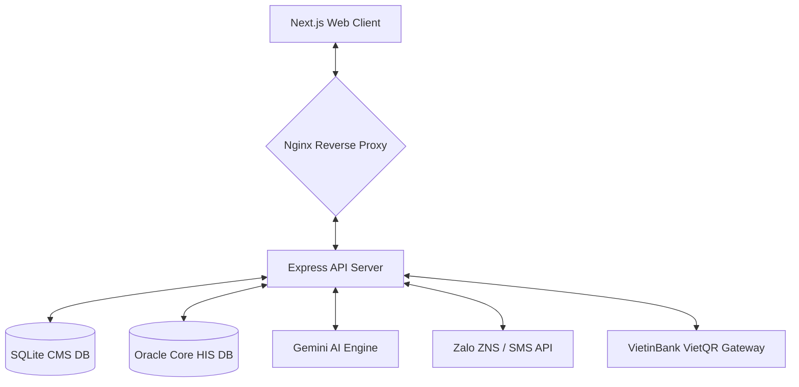
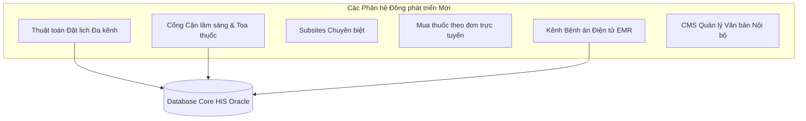

# TÀI LIỆU ĐẶC TẢ HỆ THỐNG PHẦN MỀM WEBSITE & CỔNG THÔNG TIN TÍCH HỢP
## VIỆN Y DƯỢC HỌC DÂN TỘC THÀNH PHỐ HỒ CHÍ MINH

> **Phiên bản:** 1.0 (Chính thức)  
> **Ngày soạn:** 21/05/2026  
> **Đối tượng:** Ban Giám đốc, Phòng CNTT & Đối tác Đồng phát triển (ODH & Hải Nhân)  
> **Tác giả:** Bộ phận Công nghệ Thông tin — Viện YDHDT  
> **Tính chất:** Tài liệu kỹ thuật chuyên nghiệp phục vụ phối hợp triển khai  

---

## MỤC LỤC

1. [Tầm nhìn & Định hướng Chiến lược](#1-tầm-nhìn--định-hướng-chiến-lược)
2. [Kiến trúc Công nghệ Tổng thể (Tech Stack)](#2-kiến-trúc-công-nghệ-tổng-thể-tech-stack)
3. [Kiến trúc Dữ liệu Song song (Dual-Database Architecture)](#3-kiến-trúc-dữ-liệu-song-song-dual-database-architecture)
4. [Đặc tả Phân hệ Đã hoàn thiện (Sẵn sàng Vận hành)](#4-đặc-tả-phân-hệ-đã-hoàn-thiện-sẵn-sàng-vận-hành)
5. [Đặc tả Phân hệ Nâng cao & Yêu cầu Đồng phát triển (Mới)](#5-đặc-tả-phân-hệ-nâng-cao--yêu-cầu-đồng-phát-triển-mới)
6. [Phương án Phối hợp Kỹ thuật & Phân vai Phát triển](#6-phương-án-phối-hợp-kỹ-thuật--phân-vai-phát-triển)

---

## 1. Tầm nhìn & Định hướng Chiến lược

Hệ thống Website mới của Viện Y Dược Học Dân Tộc TP.HCM không chỉ đơn thuần là cổng thông tin giới thiệu hành chính, mà được định hình là **Cổng Dịch vụ Y tế Số tích hợp toàn diện**, lấy người bệnh làm trung tâm. 

### Các mục tiêu chiến lược bao gồm:
* **Tối ưu hóa hành trình người bệnh:** Đưa tất cả các nhu cầu cốt lõi của người bệnh (đặt lịch, tra cứu kết quả cận lâm sàng, xem hồ sơ bệnh án, hỏi đáp y học) lên môi trường số trực quan, giảm thiểu thời gian chờ đợi tại bệnh viện.
* **Đồng bộ hóa vận hành:** Kết nối chặt chẽ và an toàn tuyệt đối với hệ thống Quản lý Bệnh viện hiện tại (Core HIS).
* **Nâng cao năng lực quản trị nội bộ:** Cung cấp công cụ điều hành, quản lý văn bản pháp quy, báo cáo số liệu tự động cho ban lãnh đạo và các phòng ban.
* **Xây dựng uy tín học thuật & truyền thông:** Tách biệt các mảng nội dung chuyên sâu (Tin tức y tế, Hỏi đáp y khoa, Giới thiệu dịch vụ Đông y) để người dùng dễ tiếp cận.

---

## 2. Kiến trúc Công nghệ Tổng thể (Tech Stack)

Hệ thống được phát triển theo mô hình **Monorepo** hiện đại, đảm bảo tính mô-đun hóa, dễ nâng cấp và mở rộng, đồng thời tận dụng tối đa năng lực xử lý bất đồng bộ.

### 2.1 Phân hệ Frontend (Cổng thông tin công khai & Admin Portal)
* **Framework chính:** Next.js (App Router, sử dụng trình biên dịch siêu tốc Turbopack).
* **Thư viện giao diện:** React 19, Tailwind CSS v4 (cho phép tùy biến linh hoạt, tải trang nhanh tối đa), Shadcn/ui.
* **Hiệu ứng & Chuyển động mượt mà:** Framer Motion.
* **Đa ngôn ngữ (i18n):** `next-intl` (Hỗ trợ 3 ngôn ngữ: Tiếng Việt, Tiếng Anh, Tiếng Trung) hoạt động dựa trên Cookie để tối ưu cho các thiết bị mạng nội bộ và ứng dụng di động.
* **Cơ chế tải và hiển thị:** Server-Side Rendering (SSR) kết hợp Static Site Generation (SSG) cho các trang tin tức giúp tối ưu SEO vượt trội.

### 2.2 Phân hệ Backend (API Server)
* **Môi trường chạy:** Node.js tích hợp TypeScript nghiêm ngặt.
* **Framework API:** Express.js với kiến trúc phân tách Router - Service - Controller rõ ràng.
* **Trình kết nối CSDL:**
  * **Oracle HIS:** Kết nối trực tiếp qua `oracledb` thick client (sử dụng Instant Client cấu hình tối ưu).
  * **Web CMS:** Sử dụng `better-sqlite3` chạy ở chế độ **WAL (Write-Ahead Logging)** cho tốc độ đọc/ghi cực nhanh, loại bỏ hiện tượng khóa file.

### 2.3 Phân hệ Tích hợp & Hạ tầng
* **AI Engine:** Google Gemini 2.0 Flash phục vụ hỏi đáp y tế và dược liệu Đông y.
* **Payment Gateway:** Tích hợp cổng thanh toán VietQR (VietinBank) tự động sinh mã QR động và đồng bộ trạng thái thanh toán thời gian thực qua cơ chế **Server-Sent Events (SSE)**.
* **Hạ tầng máy chủ:** Triển khai trên **Windows Server** thông qua IIS Reverse Proxy (kết hợp NSSM dịch vụ) hoặc đóng gói **Docker Compose** đồng bộ. Tích hợp sẵn cơ chế CI/CD tự động thông qua GitHub Actions.

---

## 3. Kiến trúc Dữ liệu Song song (Dual-Database Architecture)

Để giải quyết bài toán an toàn thông tin y tế nhạy cảm nhưng vẫn đảm bảo website vận hành linh hoạt với lưu lượng truy cập lớn, hệ thống áp dụng mô hình **Dual-Database (Hai cơ sở dữ liệu song song)**:

| Tiêu chí | Cơ sở dữ liệu Core HIS (Oracle 19c) | Cơ sở dữ liệu Web CMS (SQLite/PostgreSQL) |
|---|---|---|
| **Vai trò** | Lưu trữ toàn bộ dữ liệu lâm sàng, hồ sơ bệnh án, lịch đặt khám thực tế, danh mục bác sĩ chính thức từ bệnh viện. | Lưu trữ tài khoản quản trị website, nội dung bài viết, tin tức, hình ảnh bác sĩ chi tiết, đánh giá của người bệnh, logs hệ thống. |
| **Cơ chế truy cập** | **Đọc/Ghi Real-time** có chọn lọc thông qua các API an toàn được cấu hình sẵn trong mạng LAN nội bộ. | Truy cập trực tiếp từ máy chủ Web với tốc độ cực cao, lưu trữ độc lập với hạ tầng bệnh viện. |
| **Lý do thiết kế** | **Single Source of Truth:** Đảm bảo số liệu lịch hẹn, giá dịch vụ đồng nhất 100% với hệ thống lễ tân đang dùng. | **Cách ly bảo mật:** Ngăn chặn hoàn toàn nguy cơ tấn công SQL Injection từ bên ngoài vào cơ sở dữ liệu bệnh án y khoa. Giảm tải tối đa cho máy chủ HIS. |

### Cơ chế kết hợp dữ liệu (Data Blending):
Khi người dùng truy cập vào trang chi tiết bác sĩ, Backend sẽ thực hiện truy vấn song song: lấy thông tin lịch khám và tên bác sĩ thời gian thực từ Oracle HIS, đồng thời lấy tiểu sử chi tiết và hình ảnh chất lượng cao từ Web CMS DB, sau đó ghép lại (Blend) để hiển thị lên giao diện Next.js mà không làm ảnh hưởng đến hiệu năng của một trong hai cơ sở dữ liệu.

---

## 4. Đặc tả Phân hệ Đã hoàn thiện (Sẵn sàng Vận hành)

Hiện tại, đội ngũ CNTT nội bộ của Viện đã phát triển hoàn tất khoảng 98% các tính năng nền tảng của hệ thống:

### 4.1 Phân hệ Người bệnh (Patient Portal & Public Site)
* **Giao diện trang chủ chuyên nghiệp:** Thiết kế theo phong cách các bệnh viện đại học hiện đại, có banner mosaic uy tín, khu vực thống kê nhanh và danh mục chuyên khoa nổi bật (châm cứu, vật lý trị liệu, trĩ, xoa bóp bấm huyệt).
* **Đa chế độ đặt lịch khám trực tuyến:** Cho phép người bệnh đặt lịch theo 3 cách linh hoạt:
  1. Đặt lịch theo **Chuyên khoa**.
  2. Đặt lịch theo **Bác sĩ yêu thích**.
  3. Đặt lịch theo **Ngày mong muốn**.
* **Tra cứu lịch khám bằng OTP:** Bệnh nhân chỉ cần nhập số điện thoại → Nhận mã OTP (gửi qua SMS/Zalo) → Xem toàn bộ lịch sử hẹn khám, trạng thái (Chờ xác nhận / Đã xác nhận / Đã khám / Đã hủy).
* **Hệ thống đánh giá bác sĩ sau khám:** Sau khi hoàn tất khám bệnh, liên kết đánh giá được tự động gửi qua Zalo/Email cho bệnh nhân để chấm điểm 1-5 sao và viết nhận xét. Admin duyệt trước khi hiển thị lên profile bác sĩ.
* **Trợ lý ảo AI Chatbot 24/7:** Tích hợp mô hình Gemini 2.0 Flash được huấn luyện chuyên biệt về thông tin giờ giấc khám bệnh của Viện, kiến thức các cây thuốc Đông y, bài thuốc cổ truyền. **[Cập nhật 25/05/2026]** Đã tách thành **Cổng quản trị Chatbot AI độc lập** tại `/chatbot` cho phép Giám đốc truy cập trực tiếp không cần đăng nhập (Token bypass), tích hợp 7 tab quản trị chuyên sâu (Chat Simulator, Tổng quan, Kiến thức RAG, Lịch khám, Hội thoại, Cần bổ sung, Cài đặt), gieo hạt 15 thẻ tri thức Đông Y chuẩn xác, hiệu ứng Cyber/Framer Motion cao cấp, và cơ chế tự động migration sửa đổi dữ liệu cũ trong SQLite.

### 4.2 Phân hệ Quản trị & CMS Nội bộ (Admin Portal)
* **Trình soạn thảo bài viết nâng cao (Rich-text Editor):** Tích hợp công cụ Tiptap v2, cho phép biên tập viên soạn thảo tin tức, quyết định y tế chuyên sâu, nhúng video, ảnh, định dạng bảng biểu và đính kèm file PDF văn bản hành chính một cách dễ dàng.
* **Hệ thống phân quyền 5 cấp (RBAC):** Định nghĩa rõ vai trò và quyền hạn truy cập của từng nhân sự tham gia vận hành:
  * `super_admin`: Toàn quyền hệ thống, quản lý tài khoản và phân quyền.
  * `admin`: Quản lý nội dung, danh mục bác sĩ, duyệt đánh giá, quản lý lịch hẹn.
  * `editor`: Chỉ được phép soạn thảo và chỉnh sửa bài viết ở dạng Nháp.
  * `moderator`: Được quyền phê duyệt và lên lịch xuất bản bài viết, không có quyền xóa.
  * `viewer`: Chỉ xem số liệu thống kê.
* **Scheduled Publishing (Hẹn giờ xuất bản):** Cho phép đặt lịch đăng bài viết tự động theo giờ cấu hình sẵn.
* **Thư viện Media & Thống kê dung lượng:** Quản lý tập trung toàn bộ ảnh, file đính kèm, hiển thị dung lượng sử dụng theo từng nhóm định dạng.
* **Analytics trực quan (Recharts):** Bảng điều khiển admin tích hợp các biểu đồ phân tích dữ liệu trực quan:
  * Biểu đồ đường (LineChart): Xu hướng đặt lịch khám trong 14 ngày gần nhất.
  * Biểu đồ cột ngang (BarChart): Danh sách top 8 bài viết y khoa được xem nhiều nhất.
  * Biểu đồ tròn (PieChart): Phân bổ trạng thái bài viết (Đã đăng / Nháp / Đang chờ).
* **Hệ thống giám sát và bảo mật tự động:**
  * **Daily Auto-Backup:** Tự động sao lưu toàn bộ dữ liệu CMS SQLite vào lúc 2:00 sáng hàng ngày, nén định dạng `.tar.gz` và tự động gửi báo cáo trạng thái chi tiết qua email ban quản trị.
  * **System Logs Viewer:** Xem và theo dõi nhật ký ghi lỗi hệ thống trực tiếp trên giao diện Admin.
  * **Vá lỗi xác thực Cổng nội bộ:** Đã khắc phục triệt để lỗi phân tách token xác thực qua Cookie HTTP-Only Lax và đồng bộ hóa trạng thái đăng nhập cho toàn bộ các trang chức năng Admin (Analytics, Media, Reviews).

---

## 5. Đặc tả Phân hệ Nâng cao & Yêu cầu Đồng phát triển (Mới)

Bám sát ý kiến đóng góp từ Ban giám đốc và phản hồi từ phía đối tác giàu kinh nghiệm trong cuộc họp ngày 20/05/2026, hệ thống cần được mở rộng và đồng phát triển các phân hệ nâng cao để giải quyết triệt để các bài toán thực tế của người bệnh và năng lực quản lý của Viện.

### 5.1 Thuật toán Đặt lịch khám Đa kênh Phức tạp (Multi-channel Booking Engine)
* **Mô tả bài toán:** Quy trình đặt khám của bệnh viện rất phức tạp vì dữ liệu lịch khám của bác sĩ đến từ nhiều nguồn khác nhau: Tổng đài đặt lịch (Call Center), Website chính thức, Ứng dụng di động (Mobile App), và bệnh nhân đăng ký trực tiếp tại quầy lễ tân (Walk-ins). 
* **Giải pháp & Định hướng Phát triển:**
  * Xây dựng **Bộ máy đồng bộ và quản lý phòng khám (Clinic Availability Engine)** kết nối trực tiếp với lịch trực của bác sĩ trên Core HIS.
  * Thiết lập cơ chế **Chiếm slot tạm thời (Session Lock / Optimistic Locking)** ở tầng API: Khi người bệnh chọn một khung giờ trên web/app, hệ thống sẽ tạm khóa slot đó trong vòng 5-10 phút để người bệnh thực hiện điền thông tin và thanh toán. Nếu quá thời gian hoặc thanh toán thất bại, slot sẽ được giải phóng lập tức để tổng đài viên hoặc người bệnh khác có thể đăng ký.
  * Thiết lập API giao tiếp thời gian thực cho hệ thống tổng đài và các kênh đối tác khác để ghi nhận số liệu đồng nhất.

### 5.2 Cổng thông tin hồ sơ & Tra cứu kết quả Cận lâm sàng (Clinical Results Portal)
* **Mô tả bài toán:** Bệnh nhân luôn mong muốn xem lại lịch sử khám bệnh và tra cứu nhanh các kết quả cận lâm sàng của mình trước tiên ngay sau khi có kết quả từ phòng khám mà không cần phải chờ đợi lấy bản giấy tại viện.
* **Giải pháp & Định hướng Phát triển:**
  * Xây dựng giao diện an toàn trong tài khoản bệnh nhân để hiển thị:
    * **Kết quả xét nghiệm:** Bảng chỉ số hóa sinh, huyết học, vi sinh... kèm dải chỉ số bình thường để đối chiếu.
    * **Chẩn đoán hình ảnh:** Kết quả siêu âm, X-quang, CT, MRI (Hiển thị file mô tả chẩn đoán kèm hình ảnh trực quan).
    * **Toa thuốc điện tử:** Đơn thuốc bác sĩ đã kê kèm hướng dẫn liều dùng, giờ uống thuốc sinh động.
  * Phối hợp thiết lập kết nối bảo mật đến các schema dữ liệu LIS (Hệ thống thông tin phòng xét nghiệm) và PACS (Hệ thống lưu trữ và truyền hình ảnh) của Viện.
  * Sử dụng giải pháp bảo mật dữ liệu nhạy cảm theo đúng Nghị định 13/2023/NĐ-CP (mã hóa dữ liệu cá nhân, xác thực hai yếu tố 2FA khi truy cập kết quả cận lâm sàng).

### 5.3 Tái cấu trúc cấu trúc Bố cục Cổng thông tin (Separated Portals / Subsites)
* **Mô tả bài toán:** Cần tổ chức lại cấu trúc trang web để tập trung đúng vào trọng tâm nội dung người dùng muốn tìm kiếm, tránh sự rối rắm và quá tải thông tin trên một trang chung.
* **Giải pháp & Định hướng Phát triển:**
  * Chia hệ thống cổng thông tin thành các phân hệ giao diện (Sub-portals / Subsites) độc lập về bố cục nhưng chia sẻ chung dữ liệu quản trị:
    1. **Cổng Khám chữa bệnh & Dịch vụ (Main Medical Portal):** Nơi cung cấp thông tin tức thì cho người bệnh: bảng giá dịch vụ y tế, lịch khám chi tiết của bác sĩ trong tuần, form đăng ký khám nhanh, giới thiệu các loại dịch vụ y tế cổ truyền thế mạnh của Viện.
    2. **Trung tâm Tin tức & Truyền thông Y tế (News Center):** Nơi đăng tải chuyên nghiệp các bài viết y học, thông tin dịch tễ, công trình nghiên cứu khoa học, hoạt động của Viện.
    3. **Kênh Hỏi đáp Y học (Q&A Interactive Portal):** **[HOÀN THÀNH 100% - 25/05/2026]** Không gian tương tác trực tiếp giữa Bác sĩ và Người bệnh. Người bệnh gửi câu hỏi y tế tại trang Liên hệ/Hỏi đáp -> Lưu SQLite bền vững -> Bác sĩ xem danh sách, duyệt, trả lời câu hỏi tại `/admin/qna` -> Tự động đồng bộ hiển thị lên danh sách Hỏi & Đáp công khai của website để cộng đồng cùng tra cứu.
    4. **Phân hệ AI Chatbot trợ lý y khoa:** **[HOÀN THÀNH 100% - 25/05/2026]** Tự động hóa RAG tri thức y khoa từ bài viết CMS động, hỗ trợ quản lý lịch trực bác sĩ và tự động dọn dẹp (purge) tri thức rác.
    5. **Cổng quản trị AI Chatbot Độc lập (Standalone Sub-Portal):** **[HOÀN THÀNH 100% - 25/05/2026]** Tách biệt hoàn toàn khỏi CMS Admin tại đường dẫn `/chatbot`, hỗ trợ Giám đốc truy cập nhanh không cần đăng nhập qua Token bảo mật, giao diện thuần Việt 100% với hiệu ứng Cyber/Framer Motion, 7 tab quản trị chuyên sâu, gieo hạt 15 thẻ tri thức Đông Y, cơ chế DB Auto-migration tự động sửa đổi thông tin bệnh viện cũ sang chuẩn mới, và chuẩn hóa toàn bộ địa chỉ liên hệ trên toàn hệ thống (273 - 275 Nguyễn Văn Trỗi, Phường 10, Quận Phú Nhuận, TP. Hồ Chí Minh). Xem chi tiết tại [AI_CHATBOT_ENHANCEMENTS.md](AI_CHATBOT_ENHANCEMENTS.md).

### 5.4 Phân hệ Mua sắm Dược phẩm Trực tuyến (Pharmacy Online Booking)
* **Mô tả bài toán:** Người bệnh y học cổ truyền thường có nhu cầu bốc thuốc Đông y, mua các loại dược liệu thành phẩm uy tín của Viện và giao tận nhà. Việc đặt mua thuốc y tế đòi hỏi quy trình kiểm soát toa thuốc vô cùng chặt chẽ.
* **Giải pháp & Định hướng Phát triển:**
  * Xây dựng luồng **Đặt mua dược phẩm theo đơn (Prescription Pharmacy Booking)**:
    * Người bệnh tải lên hình ảnh toa thuốc do bác sĩ Viện kê đơn.
    * Hệ thống chuyển tiếp yêu cầu đến Dược sĩ thuộc khoa Dược kiểm duyệt trên Admin Dashboard.
    * Sau khi được phê duyệt và xác định giá trị đơn hàng phù hợp với kho dược của HIS, hệ thống sẽ gửi liên kết thanh toán và xác nhận giao hàng qua Zalo/Email cho người bệnh.

### 5.5 Kênh cung cấp Bệnh án Điện tử Bảo mật cao (EMR Channel)
* **Mô tả bài toán:** Hướng tới bệnh viện không giấy tờ, cung cấp cổng thông tin Bệnh án điện tử chính thức, tuân thủ các thông tư của Bộ Y tế về số hóa hồ sơ bệnh án.
* **Giải pháp & Định hướng Phát triển:**
  * Phát triển phân hệ lưu trữ và kết xuất bệnh án điện tử (EMR) chuẩn hóa định dạng XML/JSON tương thích với các cổng bảo hiểm y tế quốc gia.
  * Tích hợp chữ ký số (Digital Signature) của bác sĩ và chữ ký số của Viện để đảm bảo tính pháp lý của bệnh án xuất xưởng trực tuyến.
  * Áp dụng tiêu chuẩn bảo mật dữ liệu cấp độ 3 cho máy chủ lưu trữ bệnh án điện tử.

### 5.6 Phân hệ Quản lý Điều hành & CMS Văn bản Nội bộ (Operations CMS)
* **Mô tả bài toán:** Trang quản trị nội bộ cần tích hợp riêng một phân hệ phục vụ công tác hành chính văn phòng, lưu trữ báo cáo số liệu và văn bản chỉ đạo.
* **Giải pháp & Định hướng Phát triển:**
  * Xây dựng phân hệ **Quản lý văn bản pháp quy & Báo cáo điều hành**:
    * Cho phép đăng tải, gắn thẻ phân loại các nghị quyết, thông tư, quyết định của Viện và Bộ Y tế.
    * Hệ thống phân quyền đọc văn bản chi tiết: chỉ những nhân viên có chức danh phù hợp mới được xem các tài liệu lưu hành nội bộ hoặc báo cáo tài chính, báo cáo nhân sự chuyên sâu.
    * Công cụ tìm kiếm văn bản toàn văn (Full-text Search) tốc độ cao.

---

## 6. Phương án Phối hợp Kỹ thuật & Phân vai Phát triển

Để hiện thực hóa các phân hệ nâng cao trên một cách hoàn hảo nhất, đồng thời phát huy tối đa thế mạnh và kinh nghiệm dày dặn của đối tác cùng năng lực vận hành thực tế của Phòng CNTT Viện, phương án phối hợp kỹ thuật được phân định rõ ràng như sau:

### 6.1 Trách nhiệm của Phòng CNTT Viện YDHDT
* **Hạ tầng kết nối mạng LAN:** Đảm bảo kết nối nội mạng ổn định, thông suốt và an toàn giữa máy chủ Web production và máy chủ database Core HIS Oracle (`192.168.1.113`).
* **Cổng API Core HIS:** Phòng CNTT sẽ trực tiếp viết hoặc mở các Stored Procedures, Views an toàn trên CSDL Oracle để phục vụ các yêu cầu đọc dữ liệu lịch khám, kết quả xét nghiệm, chẩn đoán PACS và ghi dữ liệu đặt lịch khám.
* **Cung cấp tài khoản & Cấu hình:** Bàn giao tài khoản SMTP gửi mail chính thức, cổng kết nối Zalo OA, API Key SMS của Viện cho hệ thống sản xuất.

### 6.2 Trách nhiệm của Đối tác Đồng phát triển (ODH & Hải Nhân)
* **Thuật toán & Công nghệ Đặt lịch đa kênh:** Thiết kế lõi thuật toán khóa giữ chỗ (Slot locking) tối ưu, xử lý bất đồng bộ tránh race condition khi nhiều nguồn cùng truy cập.
* **Thiết kế & Lập trình Giao diện Portal nâng cao:** Phát triển toàn bộ giao diện Next.js cho các subsites (Trang dịch vụ khám chữa bệnh, Trung tâm tin tức, Hỏi đáp y khoa) và Cổng Cận lâm sàng, Cổng Dược phẩm trực tuyến.
* **Xây dựng module Quản lý Điều hành & Văn bản CMS:** Phát triển phân hệ điều hành, phân loại văn bản nội bộ và hệ thống phân quyền phòng ban nâng cao trên Admin Portal.
* **Hỗ trợ Tích hợp Bệnh án Điện tử (EMR) & Security:** Đưa các tiêu chuẩn bảo mật mã hóa y tế, chuẩn HL7/FHIR vào cấu hình hệ thống bệnh án điện tử, tích hợp quy trình ký số.

Phòng CNTT Viện Y Dược Học Dân Tộc TP.HCM tin tưởng rằng với sự phối hợp chặt chẽ, chia sẻ kinh nghiệm kỹ thuật đỉnh cao giữa hai bên, hệ thống Website và Cổng thông tin tích hợp của Viện sẽ trở thành một hình mẫu tiêu biểu về chuyển đổi số y tế số chất lượng cao tại Việt Nam.
