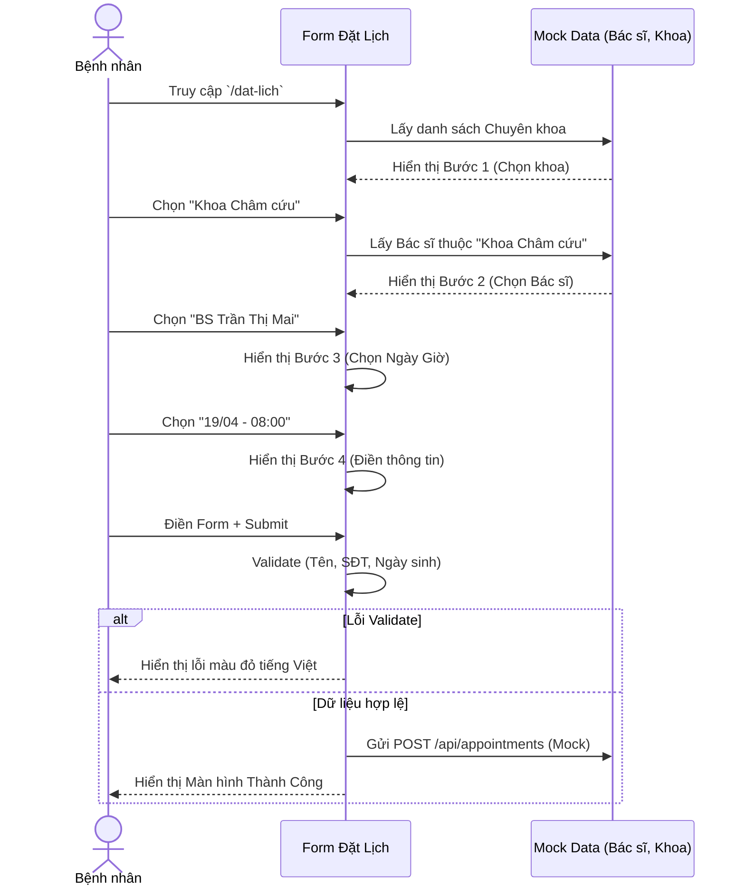

# 📅 Luồng Nghiệp Vụ: Đặt Lịch Khám Bệnh

## 1. Mô tả luồng (Flow Description)
Chức năng cốt lõi cho phép người bệnh đặt lịch khám trực tuyến tại Viện Y Dược Học Dân Tộc. Để giảm tải và tránh gây rối cho người lớn tuổi, form đặt lịch được thiết kế theo dạng **Step-by-step (Đa bước)** kết hợp Single Page Form với trải nghiệm mượt mà.

### Các bước đặt lịch:
- **Bước 1: Chọn Chuyên Khoa:** Liệt kê các khoa (Nội, Châm cứu, Dưỡng sinh...).
- **Bước 2: Chọn Bác Sĩ:** Dựa vào khoa đã chọn, lọc ra danh sách bác sĩ tương ứng. Nếu người dùng chọn "Không chọn bác sĩ cụ thể", hệ thống sẽ tự sắp xếp.
- **Bước 3: Chọn Thời Gian:** Chọn ngày khám (bỏ qua Chủ Nhật) và khung giờ khám dựa trên lịch làm việc của bác sĩ.
- **Bước 4: Thông Tin Bệnh Nhân:** Nhập họ tên, số điện thoại, ngày sinh, giới tính và mô tả triệu chứng.
- **Hoàn thành:** Gửi dữ liệu, hiển thị thông báo thành công.

---

## 2. Sequence Diagram



---

## 3. Cấu trúc Dữ Liệu (Form Data)

*(SSOT từ `src/lib/types.ts`)*

```typescript
export interface BookingFormData {
  departmentId: string;
  doctorId: string;
  appointmentDate: string;
  appointmentTime: string;
  patientName: string;
  patientPhone: string;
  patientDob: string;
  patientGender: "male" | "female" | "other";
  symptoms: string;
}
```

---

## 4. Edge Cases Cần Xử Lý
- **Validation Số Điện Thoại:** Phải là số định dạng Việt Nam (bắt đầu bằng 0, có 10 số).
- **Ngày Khám:** Không cho phép chọn ngày trong quá khứ. Hệ thống tự động disable các ngày Chủ Nhật.
- **Quản lý State:** Sử dụng state nội bộ của React (useState) vì form không quá lớn. Nếu cần thiết sau này có thể dùng Zustand.
- **Cảnh báo chuyển bước:** Nếu chưa điền đủ dữ liệu ở Bước 1, không cho phép bấm "Tiếp tục" sang Bước 2.
- **Trải nghiệm truy cập (Accessibility):** Các field nhập liệu phải có `label` gắn liền với `id` của `input` tương ứng, và có thông báo lỗi (aria-errormessage) nếu có.
