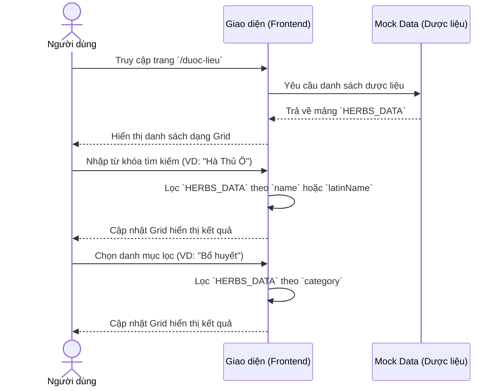

# 🌿 Luồng Nghiệp Vụ: Tra Cứu Từ Điển Dược Liệu

## 1. Mô tả luồng (Flow Description)
Chức năng cho phép người dùng (bệnh nhân, bác sĩ, sinh viên y khoa) tra cứu thông tin chi tiết về các vị thuốc Đông y (Dược liệu) đang được sử dụng tại Viện Y Dược Học Dân Tộc.

### Tính năng chính:
- Hiển thị danh sách tất cả dược liệu dưới dạng lưới (Grid).
- Tìm kiếm dược liệu theo tên tiếng Việt hoặc tên Latin.
- Lọc dược liệu theo danh mục (Bổ khí, Bổ huyết, Thanh nhiệt...).
- Hiển thị thông tin tóm tắt trên thẻ (Card): hình ảnh, tên, tính vị, công dụng chính.

---

## 2. Sequence Diagram



---

## 3. Cấu trúc Dữ Liệu (Interface)

*(SSOT từ `src/lib/types.ts`)*

```typescript
export interface Herb {
  id: string;
  slug: string;
  name: string;            // "Hà Thủ Ô Đỏ"
  latinName: string;       // "Polygonum multiflorum Thunb."
  category: HerbCategory;  // "Bổ huyết", "Bổ khí", ...
  description: string;     // Mô tả ngắn
  benefits: string[];      // ["Bổ gan thận", "Đen râu tóc"]
  usage: string;           // Cách dùng, liều lượng
  caution: string;         // Lưu ý, chống chỉ định
  imageUrl: string;
  isFeatured: boolean;
}
```

---

## 4. Edge Cases Cần Xử Lý
- **Không tìm thấy kết quả:** Khi người dùng nhập từ khóa không khớp, cần hiển thị thông báo "Không tìm thấy dược liệu phù hợp" rõ ràng, thân thiện.
- **Tối ưu hình ảnh:** Dùng `next/image` với thuộc tính `priority` cho các dược liệu nổi bật ở đầu danh sách để cải thiện LCP (Largest Contentful Paint).
- **Responsive:** Dạng Grid phải chuyển đổi từ 1 cột (Mobile) sang 2 cột (Tablet) và 3-4 cột (Desktop).
